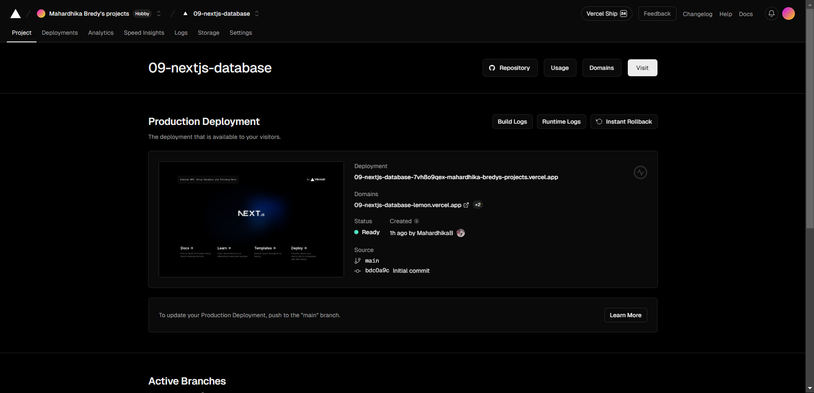
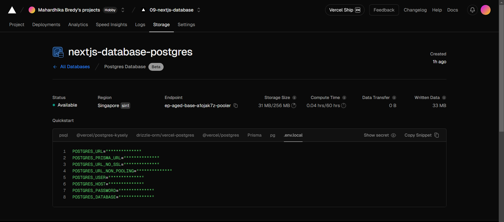
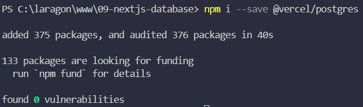
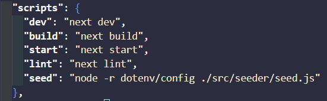
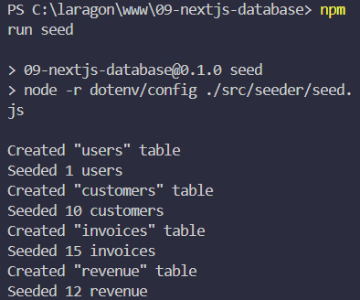
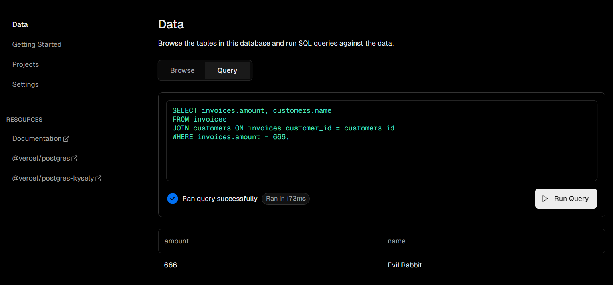

# Pertemuan 09 : Setup Database dan Fetching Data

## **Praktikum 1: Setup Database**

### **Soal 1 : Capture hasil deploy project Anda dan buatlah laporan di file README.md. Jelaskan apa yang telah Anda pelajari?**

Pada soal pertama diberi cara untuk mendaftar akun dan mengkoneksikan github dengan vercel lalu memilih repo github yang akan dideploy dan mendeploynya ke vercel.

### **Soal 2 : Capture hasil basis data Anda dan buatlah laporan di file README.md. Jelaskan apa yang telah Anda pelajari**

Menjelaskan cara membuat database baru menggunakan PosgreSQL, mengkonfigurasi database, dan membuat dan mengkonfigurasi file .env.

### **Soal 3 : Capture hasil npm run seed Anda dan buatlah laporan di file README.md. Jelaskan apa yang telah Anda pelajari ?**

Setting package.json untuk kustomisasi perintah run dan melakukan seeder ke database.

### **Soal 4 : Capture hasil query Anda dan buatlah laporan di file README.md. Jelaskan apa yang telah Anda pelajari ?**

Mengecek apakah data yang telah dibuat sebelumnya sudah terbaca pada dashboard dan mencoba melakukan query sederhana dimana mencari nama customer nama dan tagihan berdasarkan customer id.

